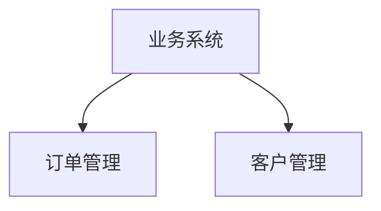

# Markdown Content Extractor

从分散的 Markdown 文件中按规则提取内容，支持跨目录引用、多层嵌套、Mermaid 结构图解析。

## 功能特性

- **跨目录文件引用**：支持 `[docs/背景.md]`、`../shared/文件.md` 等多种路径格式
- **多层嵌套目录**：自动递归加载所有引用的文件
- **Mermaid 结构图解析**：从结构图中提取自然语言描述
- **标题容错匹配**：支持编号前缀、中文/英文冒号等变体
- **代码块过滤**：正确跳过代码块内的假标题
- **无外部依赖**：纯 Python 标准库实现

## 快速开始

### 1. 获取项目

```bash
git clone https://github.com/your-username/md-extract.git
cd md-extract
```

### 2. 准备文件

创建以下文件结构：

```
your-project/
├── source.md           # 主入口文件
├── template.yaml       # 提取规则
├── output-template.md  # 输出模板
├── extractor.py        # 提取脚本
└── content/            # 你的 Markdown 文件
    ├── chapter-01/
    ├── chapter-02/
    └── ...
```

### 3. 配置

编辑 `extractor.py` 顶部的配置区：

```python
# 【必须配置】主入口文件路径
SOURCE_FILE = 'source.md'

# 【可选配置】项目根目录
PROJECT_ROOT = None  # 自动检测
```

### 4. 运行

```bash
python extractor.py
```

### 5. 查看结果

- `result.md`：提取后的内容
- `diagnostics.json`：诊断信息

---

## 详细配置

### 主入口文件 (source.md)

主入口文件用于声明要引用的其他 Markdown 文件：

```markdown
# 项目文档

## 项目背景
详见：[content/chapter-01/背景概述.md]

## 建设目标
详见：[content/chapter-02/目标分解.md]

## 实施范围
详见：[content/chapter-03/范围说明.md]
```

**支持的引用格式**：

| 格式 | 示例 | 说明 |
|------|------|------|
| 相对路径 | `[content/背景.md]` | 从项目根目录查找 |
| 上级目录 | `[../shared/文件.md]` | 相对当前文件 |
| 当前目录 | `[./overview/文件.md]` | 当前目录子文件夹 |
| 文本格式 | `详见：docs/背景.md` | 纯文本引用 |

---

### 提取规则 (template.yaml)

定义要提取的字段和匹配模式：

```yaml
# 字段名: 输出结果中的字段名
background:
  - "项目背景"    # 匹配模式
  - "背景说明"
  - "需求背景"

goal:
  - "建设目标"
  - "项目目标"

scope:
  - "实施范围"
  - "项目范围"
```

**匹配规则**：

- 双向包含：标题包含关键词 或 关关键词包含标题
- 自动去除编号前缀：`一、`、`1.`、`（一）` 等
- 自动去除末尾冒号：中文 `：` 或英文 `:`

**匹配示例**：

| 模板模式 | 能匹配的标题 |
|----------|-------------|
| `项目背景` | `## 一、项目背景说明：` |
| `项目背景` | `## 项目背景` |
| `背景说明` | `## 背景说明` |

---

### 输出模板 (output-template.md)

定义输出结果的格式：

```markdown
# 提取结果

## 背景

{{background}}

---

## 目标

{{goal}}

---

## 范围

{{scope}}
```

使用 `{{字段名}}` 作为占位符，提取器会自动替换。

---

### extractor.py 配置区

```python
# ============================================================================
#                           配 置 区
# ============================================================================

# 【必须配置】主入口文件路径
SOURCE_FILE = 'source.md'

# 【可选配置】项目根目录
PROJECT_ROOT = None  # 自动检测

# 【必须配置】模板文件路径
TEMPLATE_FILE = 'template.yaml'

# 【可选配置】输出模板文件路径
OUTPUT_TEMPLATE_FILE = 'output-template.md'

# 【可选配置】输出文件名
OUTPUT_FILE = 'result.md'

# 【可选配置】诊断信息文件名
DIAGNOSTICS_FILE = 'diagnostics.json'

# 【可选配置】最大递归深度
MAX_RECURSION_DEPTH = 5
```

---

## 使用场景

### 场景 1：标准项目结构

```
my-project/
├── source.md
├── template.yaml
├── extractor.py
└── content/
    ├── 背景/
    │   └── 背景.md
    └── 目标/
        └── 目标.md
```

配置：
```python
SOURCE_FILE = 'source.md'
PROJECT_ROOT = None
```

### 场景 2：source.md 在其他位置

```
d:/data/
└── docs/
    └── source.md

d:/tools/
└── extractor.py
```

配置：
```python
SOURCE_FILE = 'd:/data/docs/source.md'
PROJECT_ROOT = 'd:/data/docs'
```

### 场景 3：多个项目共用脚本

```
tools/
└── extractor.py

projects/
├── project-a/
│   ├── source.md
│   └── template.yaml
├── project-b/
│   ├── source.md
│   └ template.yaml
```

每次使用时修改 `SOURCE_FILE` 和 `PROJECT_ROOT`。

---

## Mermaid 结构图支持

如果被引用的文件包含 Mermaid 结构图，提取器会自动解析并生成自然语言描述：

```markdown
## 业务架构


```

提取结果会包含：

```
【结构图解读】采用层次结构；顶层：业务系统；底层：订单管理、客户管理；包含 2 条关系
```

---

## 输出文件说明

### result.md

提取后的内容，按模板格式输出：

```markdown
## 背景

【来源：content/背景/背景概述.md】
本项目旨在...

---

## 目标

【来源：content/目标/目标分解.md】
本项目的目标是...
```

### diagnostics.json

诊断信息，用于调试：

```json
{
  "rootPath": "d:/my-project",
  "filesLoaded": ["content/背景/背景概述.md", ...],
  "fileCount": 10,
  "extractionStatus": {
    "background": "success",
    "goal": "success",
    "scope": "not_found"
  },
  "totalMermaidDiagrams": 5
}
```

---

## 常见问题

### Q: 提取结果为空？

检查：
1. `source.md` 是否正确引用了目标文件
2. `template.yaml` 的匹配模式是否正确
3. 目标文件的标题是否包含匹配关键词

### Q: 文件引用找不到？

检查：
1. 引用路径是否正确（相对路径基于项目根目录）
2. 文件是否存在
3. 路径分隔符是否正确（推荐使用 `/`）

### Q: 标题匹配失败？

尝试：
1. 在 `template.yaml` 中添加更多匹配模式
2. 检查标题是否有特殊字符
3. 查看 `diagnostics.json` 中的 `headingsFound`

---

## 项目结构

```
md-extract/
├── extractor.py        # 主脚本（包含配置区）
├── template.yaml       # 提取规则模板
├── output-template.md  # 输出模板
├── README.md           # 项目说明
├── LICENSE             # MIT 许可证
└── .gitignore          # Git 忽略配置
```

---

## 许可证

MIT License - 可自由使用、修改和分发。

---

## 贡献

欢迎提交 Issue 和 Pull Request！